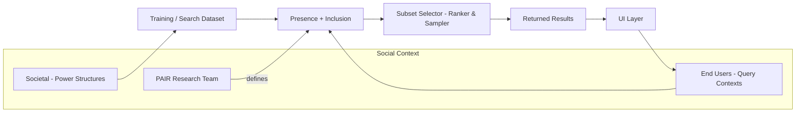

**1.1 Actor-Network (conceptual map)**

```mermaid
graph LR
    subgraph Social Context
        Power[Societal - Power Structures]
        Users[End Users - Query Contexts]
        Authors[PAIR Research Team]
    end
    Dataset[Training / Search Dataset]
    Metrics[Presence + Inclusion]
    Selector[Subset Selector - Ranker & Sampler]
    ResultSet[Returned Results]
    UI[UI Layer]

    Power --> Dataset
    Authors -->|defines| Metrics
    Dataset --> Metrics
    Metrics --> Selector
    Users --> Metrics
    Selector --> ResultSet --> UI --> Users
```

**1.2 UML (class-level flow)**

